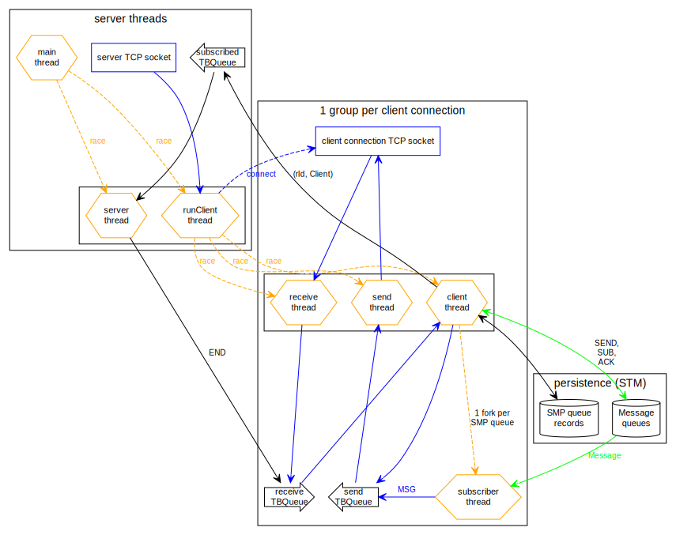

# simplex-messaging

## SMP server demo

This is a demo implementation of SMP ([simplex messaging protocol](https://github.com/simplex-chat/protocol/blob/master/simplex-messaging.md)) server.

This is not usable for real applications, as it lacks the following protocol features:

- cryptographic signature verification, instead it simply compares provided "signature" with stored "public key", effectively treating them as plain text passwords.
- there is no transport encryption

These limitations make it easy to experiment with the protocol logic via telnet.

You can either run it locally or try with the deployed demo server:

```bash
telnet smp.simplex.im 5223
```

## Run locally

[Install stack](https://docs.haskellstack.org/en/stable/install_and_upgrade/) and `stack run`.

## Usage example

Lines you should send are prefixed with `>` character, you should not type them.

Comments are prefixed with `--`, they are not part of transmission.

`>` on its own means you need to press return - telnet should be configured to send CRLF.

1. Create simplex message queue:

```telnet
>
>
> CONN 1234 -- 1234 is recipient's key


IDS QuCLU4YxgS7wcPFA YB4CCATREHkaQcEh -- recipient and sender ID for the queue
```

2. Sender can send their "key" to the connection:

```telnet
> -- no signature (just press enter)
> YB4CCATREHkaQcEh -- sender ID for the queue
> SEND :key abcd

YB4CCATREHkaQcEh
OK
```

3. Secure queue with sender's "key"

```telnet
> 1234 -- recipient's "signature" - same as "key" in the demo
> QuCLU4YxgS7wcPFA -- recipient ID
> KEY abcd -- "key" provided by sender

QuCLU4YxgS7wcPFA
OK
```

4. Sender can now send messages to the queue

```telnet
> abcd -- sender's "signature" - same as "key" in the demo
> YB4CCATREHkaQcEh -- sender ID
> SEND :hello

YB4CCATREHkaQcEh
OK
```

5. Recipient recieves the message and acknowledges it to receive further messages

```telnet

QuCLU4YxgS7wcPFA
MSG ECA3w3ID 2020-10-18T20:19:36.874Z 5
hello
> 1234
> QuCLU4YxgS7wcPFA
> ACK

QuCLU4YxgS7wcPFA
OK
```

## Design


